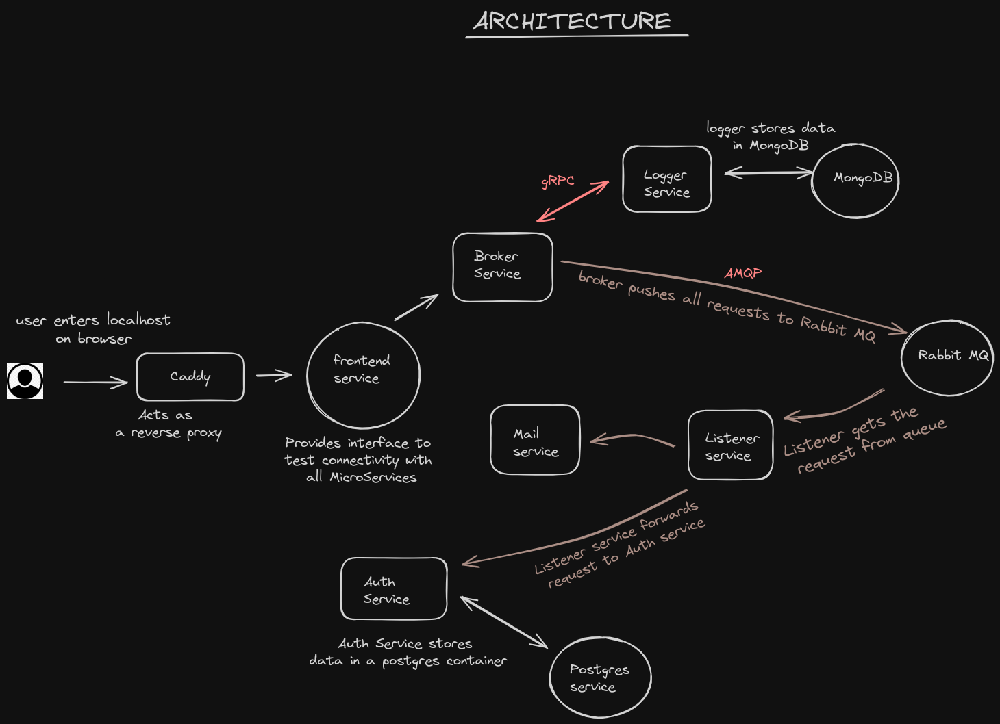

# Go-micro

This is a project consisting of 6 different microservices written in GoLang. This is an End-to-End Distributed System that uses different protocols like rpc, GRPC , REST API's and Queueing Systems for communication between the services.

The main goal of this project is to provide a clear and concise understanding of the communication mechanisms utilized by this microservice architecture-based distributed system. By doing so, users can gain a comprehensive understanding of how the system operates and how these communication mechanisms enable seamless integration between different software services, leading to a more efficient and scalable application..

This project can be deployed either via a docker swarm (also via minikube cluster in future).

---

### Demo Video

<video style="width: 70%; height: auto;" controls>
  <source src="./demo.webm" type="video/webm">>
  Sample
</video>

---

### These are the core services that perform distributed actions 
- [authentication-service](https://github.com/ayushthe1/go-micro/tree/master/authentication-service) for Authenticating users
- [Broker Service](https://github.com/ayushthe1/go-micro/tree/master/broker-service) is the central node point for handling each request from the client and rendering a response to the client. This Service calls the right service(authentication, listener, logger and mailer )  when a request is called from the front-end  
- [logger-service](https://github.com/ayushthe1/go-micro/tree/master/logger-service) receives and accepts the data from the authentication, listener and mailer service ,when each service has been called through the broker service . The data from each service is stored in a  mongoDb database.It also handles the gRPC and RPC actions when called by the broker service. 
- [mail-service](https://github.com/ayushthe1/go-micro/tree/master/mail-service) Handles sending of mails
- [listener-service](https://github.com/ayushthe1/go-micro/tree/master/listener-service) This service handles queues 
- [front-end](https://github.com/ayushthe1/go-micro/tree/master/project/Caddyfile) just displays outputs for each action performed internally
- [Caddy-service](https://github.com/ayushthe1/go-micro/tree/master/project/Caddyfile) acts as a reverse proxy. It forwards requests coming to http://localhost to the front-end service.

---

### To deploy via Docker swarm 

1. Ensure you have docker installed and running on your system.

2. In your terminal ,type `sudo nano /etc/hosts` and enter your password.

3. In the file ,add a line `127.0.0.1      backend` . The updated file should look something like this : 
 

 

4. Clone this repo

5. From inside the repo, cd into `/project` directory.

6. Type command `make deploy_swarm` in the terminal.

7. The project will be deployed on docker swarm.

